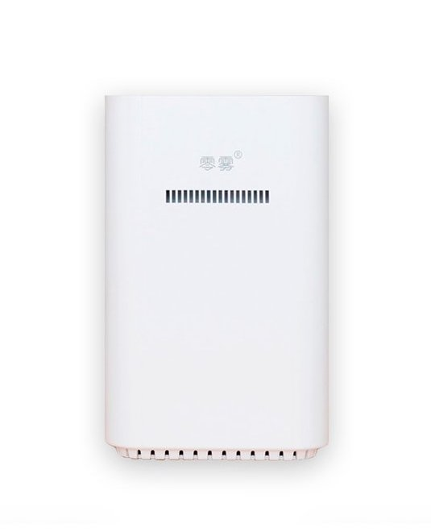
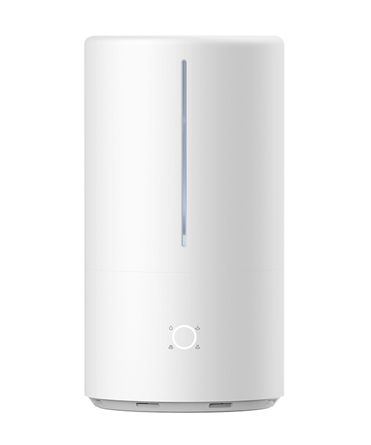

# homebridge-mi-humidifier

[](https://github.com/homebridge/homebridge/wiki/Verified-Plugins)
[](https://www.npmjs.com/package/homebridge-mi-humidifier)
[](https://www.npmjs.com/package/homebridge-mi-humidifier)
[](https://www.buymeacoffee.com/russtone)

A Xiaomi Mi humidifier plugin for Homebridge.

⚠️ The config format was changed in version 2. See the [configuration](#Configuration) section for more details.

## Installation

```
npm install -g homebridge-mi-humidifier
```

## Configuration

Add the following part to the "platforms" section of your [Homebridge config](https://github.com/homebridge/homebridge/wiki/Homebridge-Config-JSON-Explained):

```json
{
  "platform": "MiHumidifier",
  "devices": [
    {
      "name": "Humidifier",
      "address": "<ip>",
      "token": "<token>",
      "model": "zhimi.humidifier.v1",
      "updateInterval": 30,
      "disabled": false,
      "autoSwitchToHumidityMode": true,
      "disableTargetHumidity": false,
      "ledBulb": {
        "enabled": true,
        "name": "Humidifier LED"
      },
      "buzzerSwitch": {
        "enabled": true,
        "name": "Humidifier Buzzer"
      },
      "temperatureSensor": {
        "enabled": true,
        "name": "Humidifier Temperature"
      },
      "humiditySensor": {
        "enabled": true,
        "name": "Humidifier Humidity"
      }
    }
  ]
}
```

### Platform

| Key      | Description                                 |
| -------- | ------------------------------------------- |
| platform | Platform name. Has to be `MiHumidifier`     |
| devices  | Array of [devices configurations](#device). |

### Device

| Key                       | Description                                                  | Default value            |
| ------------------------- | ------------------------------------------------------------ | ------------------------ |
| name                      | Name of the device. This will appear in your Home app.       | "Humidifier"             |
| address                   | IP address of the device.                                    | —                        |
| token                     | Device token. See [obtaining token](https://github.com/Maxmudjon/com.xiaomi-miio/blob/master/docs/obtain_token.md). | —                        |
| model                     | One of:<br />- `zhimi.humidifier.v1`<br />- `zhimi.humidifier.ca1`<br />- `zhimi.humidifier.cb1`<br />- `zhimi.humidifier.ca4`<br />- `deerma.humidifier.mjjsq`<br />- `deerma.humidifier.jsq1`<br />- `deerma.humidifier.jsq3`<br />- `deerma.humidifier.jsq4`<br />- `deerma.humidifier.jsq5`<br />- `deerma.humidifier.jsqs`<br />- `shuii.humidifier.jsq001`<br />See [supported devices](#supported-devices) section for more details. | —                        |
| updateInterval            | Device values update interval in seconds. This value affects how often data (humidity, temperature, etc.) from the device is updated. | 30                       |
| disabled                  | Disable the devices. Can be used to temporary hide the device when it is not required without removing it from config. | false |
| autoSwitchToHumidityMode  | Automatically switches mode to "humidity" when target humidity is changed. Affects models: <br /> - `zhimi.humidifier.{ca1,cb1,ca4}`<br /> - `deerma.humidifier.{mjjsq,jsq1,jsq001,jsqs,jsq3,jsq4,jsq5}` | false |
| disableTargetHumidity     | Disables ability to control target humidity. In this case long press on device in Home.app will allow to control fan speed instead of target humidity. | false |
| ledBulb.enabled           | Enables additional light bulb accessory which allows to control LED lights. | false                    |
| ledBulb.name              | Name of LED lightbulb. This will appear in your Home app.    | "Humidifier LED"         |
| buzzerSwitch.enabled      | Enables additional switch accessory which allows to control buzzer. | false                    |
| buzzerSwitch.name         | Name of buzzer switch. This will appear in your Home app.    | "Humidifier Buzzer"      |
| temperatureSensor.enabled | Enables additional temperature sensor accessory.             | false                    |
| temperatureSensor.name    | Name of temperature sensor. This will appear in your Home app. | "Humidifier Temperature" |
| humiditySensor.enabled    | Enables additional humidity sensor accessory.                | false                    |
| humiditySensor.name       | Name of humidity sensor. This will appear in your Home app.  | "Humidifier Humidity"    |
| cleanModeSwitch.enabled   | Enables additional switch accessory which allows to control clean mode (only for zhimi.humidifier.ca4). | false                    |
| cleanModeSwitch.name      | Name of clean mode switch. This will appear in your Home app.    | "Humidifier Clean Mode"      |


## Supported devices

### Smartmi Humidifier 

Model: `zhimi.humidifier.v1`

Model №: CJJSQ01ZM


### Smartmi Evaporative Humidifier

Model: `zhimi.humidifier.ca1` / `zhimi.humidifier.cb1`

Model №: CJXJSQ02ZM, SKV6001EU


### Smartmi Evaporative Humidifier 2

Model: `zhimi.humidifier.ca4`

Model №: CJXJSQ04ZM


### Zero Fog Humidifier

Model: `shuii.humidifier.jsq001`

Model №: DWZF(G)-2100Z



### Mijia Smart Sterilization Humidifier (S)

Model: `deerma.humidifier.mjjsq` / `deerma.humidifier.jsq001`

Model №: SCK0A45, ZNJSQ01DEM, MJJSQ03DY



### Mijia Pure Smart Humidifier

Model: `deerma.humidifier.jsq4`

Model №: CJSJSQ01DY


